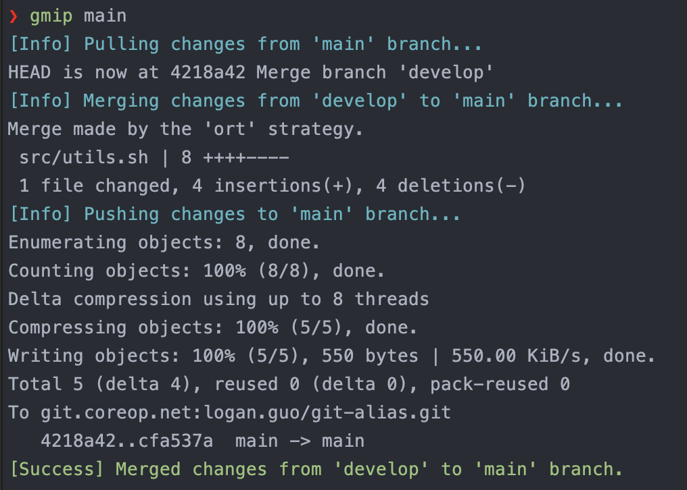
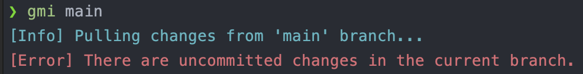

# Git Merge Into

> Useful command, Colorful result!!!

## Table of Contents

<!-- toc -->

- [Usage](#usage)
- [Example](#example)
  * [Success](#success)
  * [Error Handle - Uncommitted changes](#error-handle---uncommitted-changes)
  * [Error Handle - Merge conflict](#error-handle---merge-conflict)
- [Installation](#installation)
- [Uninstall](#uninstall)
- [Development](#development)
  * [Install packages](#install-packages)
  * [Run](#run)
  * [Build](#build)
  * [Install Locally](#install-locally)

<!-- tocstop -->

## Usage
- gmi {branch}: current branch merge into {branch}
- gmip {branch}: current branch merge into {branch} and push

```bash
gmi {branch}
gmip {branch}
```

## Example

### Success



### Error Handle - Uncommitted changes



### Error Handle - Merge conflict


## Installation

```bash
bash -c "$(curl -fsSL https://raw.githubusercontent.com/iml885203/git-merge-into/main/install.sh)"
```

## Uninstall

```bash
bash -c "$(curl -fsSL https://raw.githubusercontent.com/iml885203/git-merge-into/main/uninstall.sh)"
```

## Development

```
git clone git@github.com:iml885203/git-merge-into.git
```

### Install packages
```bash
pip install -r requirements.txt
```

### Run
```bash
python gmi.py {branch}
python gmip.py {branch}
```

### Build
```bash
./build.sh
```

### Install Locally
```bash
./install.sh --local
```