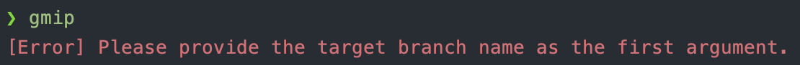

# Git Merge Into

> Useful command, Colorful result!!!

## Table of Contents
* [Usage](#usage)
* [Example](#example)
    * [Success](#success)
    * [Error Handle - Missing branch name](#error-handle---missing-branch-name)
    * [Error Handle - Uncommitted changes](#error-handle---uncommitted-changes)
    * [Error Handle - Merge conflict](#error-handle---merge-conflict)
* [Installation](#installation)
    * [CLI version](#cli-version)
* [Uninstall](#uninstall)
    * [CLI version](#cli-version-1)
* [Development CLI](#development-cli)
    * [Install packages](#install-packages)
    * [Run](#run)
    * [Build](#build)


## Usage
- gmi {branch}: current branch merge into {branch}
- gmip {branch}: current branch merge into {branch} and push

## Example

### Success


### Error Handle - Missing branch name



### Error Handle - Uncommitted changes


### Error Handle - Merge conflict


## Installation

### CLI version
```bash
bash -c "$(curl -fsSL https://raw.githubusercontent.com/iml885203/git-merge-into/main/install-cli.sh)"
```

## Uninstall

### CLI version
```bash
bash -c "$(curl -fsSL https://raw.githubusercontent.com/iml885203/git-merge-into/main/uninstall-cli.sh)"
```

## Development CLI

```
git clone git@github.com:iml885203/git-merge-into.git
```

### Install packages
```bash
pip install -r requirements.txt
```

### Run
```bash
python gmi.py {branch}
python gmip.py {branch}
```

### Build
```bash
./build-cli.sh
```