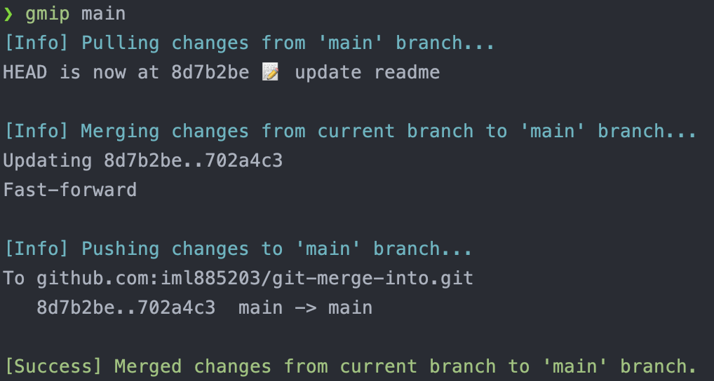

# Git Merge Into Shell Version

> Useful command, Colorful result!!!

## Usage
- gmi {branch}: current branch merge into {branch}
- gmip {branch}: current branch merge into {branch} and push

## Installation

```bash
bash install.sh
# Restart terminal
```

## Uninstall

```bash
bash uninstall.sh
# Restart terminal
```

## Example

### Success



### Error Handle - Missing branch name


### Error Handle - Uncommitted changes


### Error Handle - Merge conflict


